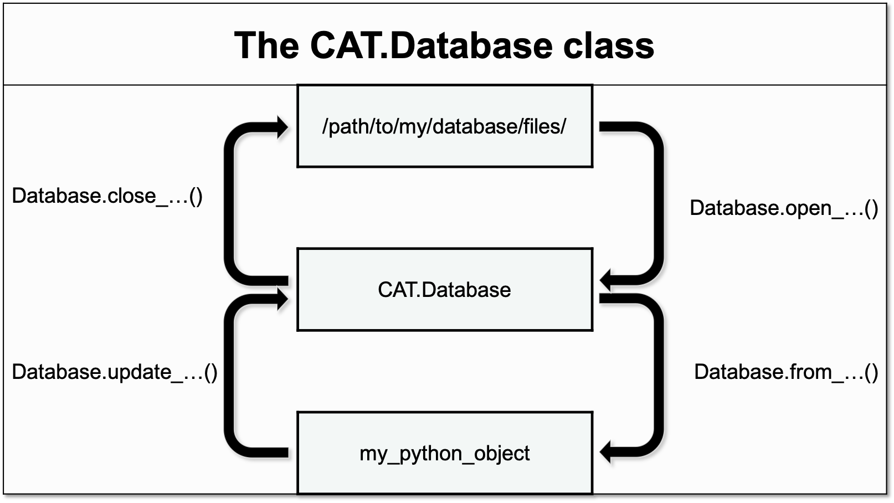

.. _Database:

The Database Class
==================

A Class designed for the storing, retrieval and updating of results.
The methods of the Database class can be divided into four categories
accoring to their function:

-   Opening the database - these methods load parts of the database from their
    respective files on the harddrive, storing them as suitable python objects
    in the Database class:

    =================  =================  ==================  ==================
    :meth:`.open_all`  :meth:`.open_csv`  :meth:`.open_yaml`  :meth:`.open_hdf5`
    =================  =================  ==================  ==================

-   Closing the database - these methods unload parts of the database from the
    Database class, storing them as suitable files on the harddrive:

    ==================  ==================  ===================  ===================
    :meth:`.close_all`  :meth:`.close_csv`  :meth:`.close_yaml`  :meth:`.close_hdf5`
    ==================  ==================  ===================  ===================

-   Importing to the database - these methods handle the importing of new data
    from python objects to the Database class:

    ===================  ====================  ====================
    :meth:`.update_csv`  :meth:`.update_yaml`  :meth:`.update_hdf5`
    ===================  ====================  ====================

-   Exporting from the database - these methods handle the exporting of data
    from the Database class to other python objects:

    =================  ==================
    :meth:`.from_csv`  :meth:`.from_hdf5`
    =================  ==================

API
~~~

.. autoclass:: CAT.data_handling.CAT_database.Database
    :members:

.. _rdkit.Chem.Mol: http://rdkit.org/docs/source/rdkit.Chem.rdchem.html#rdkit.Chem.rdchem.Mol
.. _h5py.File: http://docs.h5py.org/en/stable/high/file.html
.. _plams.Settings: https://www.scm.com/doc/plams/components/settings.html
.. _plams.Molecule: https://www.scm.com/doc/plams/components/molecule.html#id1
.. _np.ndarray: https://docs.scipy.org/doc/numpy/reference/generated/numpy.ndarray.html
.. _np.float64: https://docs.scipy.org/doc/numpy/user/basics.types.html#array-types-and-conversions-between-types
.. _np.int64: https://docs.scipy.org/doc/numpy/user/basics.types.html#array-types-and-conversions-between-types
.. _np.str_: https://docs.scipy.org/doc/numpy/reference/arrays.dtypes.html#arrays-dtypes
.. _pd.Series: https://pandas.pydata.org/pandas-docs/stable/reference/api/pandas.Series.html
.. _pd.DataFrame: https://pandas.pydata.org/pandas-docs/stable/reference/api/pandas.DataFrame.html
.. _dict: https://docs.python.org/3/library/stdtypes.html#dict
.. _list: https://docs.python.org/3/library/stdtypes.html#list
.. _tuple: https://docs.python.org/3/library/stdtypes.html#tuple
.. _str: https://docs.python.org/3/library/stdtypes.html#str
.. _int: https://docs.python.org/3/library/functions.html#int
.. _None: https://docs.python.org/3.7/library/constants.html#None

.. |rdkit.Chem.Mol| replace:: *rdkit.Chem.Mol*
.. |h5py.File| replace:: *h5py.File*
.. |plams.Molecule| replace:: *plams.Molecule*
.. |plams.Settings| replace:: *plams.Settings*
.. |pd.Series| replace:: *pd.Series*
.. |pd.DataFrame| replace:: *pd.DataFrame*
.. |np.ndarray| replace:: *np.ndarray*
.. |np.float64| replace:: *np.float64*
.. |np.int64| replace:: *np.int64*
.. |np.str_| replace:: *np.str_*
.. |dict| replace:: *dict*
.. |list| replace:: *list*
.. |tuple| replace:: *tuple*
.. |str| replace:: *str*
.. |int| replace:: *int*
.. |None| replace:: *None*
